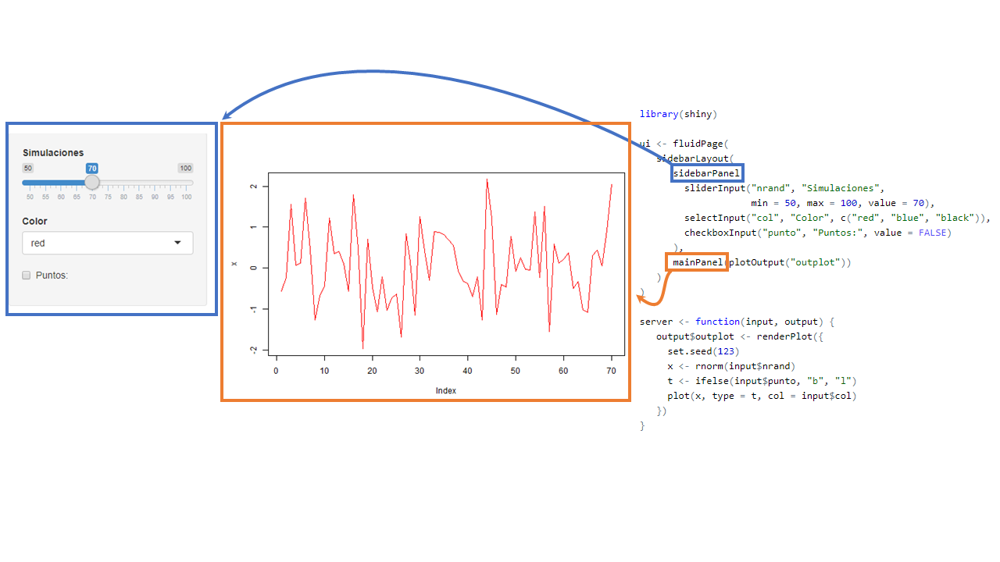

```{r setup, include=FALSE}
library(highcharter)
file.remove(dir("wdgts/", full.names = TRUE))

knitr::opts_chunk$set(fig.path = "static/img/", echo = TRUE, cache = TRUE, message = FALSE)

options(highcharter.theme =
          hc_theme_smpl(chart = list(
            backgroundColor = "transparent",
            style = list(fontFamily = "Source Sans Pro"))
            ))
source("setup.R")
```

# <br><br>Computación Estadística con R<br><small>Clase 4 <br><br> Rubén Soza</small>{ .center .white data-background="#75AADB" }

# Introducción a R Markdown{ .center .white data-background="#75AADB" }

## {data-background-video="video1.mp4"}

## ¿Qué es R Markdown?

- Marco unificado para ciencia de datos
- Combina:
    - Código
    - Resultados
- Los documentos R Markdown son totalmente reproducibles y automatizables.

## Diferentes formatos de salida

   
   
## Primer vistazo


## Detrás de escenas

`Ventaja flujo de trabajo de dos pasos:` ¡Se puede crear una amplia gama de formatos de salida!


- Word: Requiere Microsoft Word instalado.
- PDF: Requiere un compilador de LaTeX instalado.
- HTML.

## Sintaxis
- `*cursiva*` y `_cursiva_` -> *cursiva* y _cursiva_
- `**negrita**` y `__negrita__` -> **negrita** y __negrita__
- `[link](www.rstudio.com)` -> [link](www.rstudio.com)
- `# Encabezado 1`
- `## Encabezado 2`
- `### Encabezado 3`
- imagen: ``
- ` - lista`

## Código

Podemos ingresar código de R en nuestros documentos utilizando los `chunks`(ctrl + alt + I). Existen opciones que permiten manipular la acción de un chunk en específico en nuestro documento. Algunas opciones son:

Opción  | Efecto
------  | -------------------
include | ¿Muestra el fragmento de código de R y su resultado?
echo    | ¿Muestra el fragmento de código de R?
message | ¿Muestra los mensajes de salida?
warning | ¿Muestra las advertencias?
eval    | ¿Evalúa el fragmento de código?

Para más información ver el siguiente [link](https://www.rstudio.com/wp-content/uploads/2015/03/rmarkdown-reference.pdf)

## YAML

Aquí se escriben opciones generales del documento. Se pueden configurar, entre muchas otras cosas:

- Fuente y formato
- Tamaños de figuras o gráficos
- Agregar un CSS

## Código entre texto

Podemos realizar código r en cualquier oración. Para ello basta escribir


Para mayor información de todo esto, ver el siguiente [link](https://bookdown.org/yihui/rmarkdown/)

## Veamos un ejemplo en R{ .center .white data-background="#75AADB" }

# Utilizar Rmarkdown para reportar tablas{ .center .white data-background="#75AADB" }

## Paquetes útiles

Existen diferentes paquetes para generar tablas en tus reportes. Veamos 2 de ellos: `kableExtra` y `DT`. Primero cargamos la base de datos y los paquetes a utilizar:

```{r, message = FALSE}
library(tidyverse)
library(kableExtra)
library(DT)
data(iris)

```

## `kableExtra`

La función `kable()` genera una tabla que puede ser editada utilizando funciones de la librería `kableExtra`. Veamos un ejemplo sencillo: 

```{r, eval = FALSE}

kable(iris, "html") %>% 
  kable_styling("striped",position = "center", full_width = F) %>% 
  column_spec(2, bold = T, color = "red") %>% 
  add_header_above(c("Sepal" = 2, "Petal" = 2, " " = 1)) %>% 
  pack_rows("Grupo 1", 1,4) %>% 
  pack_rows("Grupo 2", 5,8) %>% 
  scroll_box(width = "100%", height = "500px") %>% 
  footnote("Tabla de Iris")
```

----
```{r, echo = FALSE}
kable(iris) %>% 
  kable_styling("striped",position = "center", full_width = F) %>% 
  column_spec(2, bold = T, color = "red") %>% 
  add_header_above(c("Sepal" = 2, "Petal" = 2, " " = 1)) %>% 
  pack_rows("Grupo 1", 1,4) %>% 
  pack_rows("Grupo 2", 5,8) %>% 
  scroll_box(width = "100%", height = "500px") %>% 
  footnote("Tabla de Iris")
```
Para mayor información ver este [link](https://cran.r-project.org/web/packages/kableExtra/vignettes/awesome_table_in_html.html)

## `DT`

La librería `DT` permite realizar tablas más customizables.

```{r, eval = FALSE}
library(DT)
datatable(iris, filter = "top")
```
Para más información ver este [link](https://rstudio.github.io/DT/)


## Ejercicios: parte I (Basados en [DataCamp](https://www.datacamp.com/projects/139) )

Convertir los títulos de las secciones de estos párrafos en encabezados utilizando la sintaxis apropiada, usando diferentes niveles de encabezado para las secciones y subsecciones:

- Secciones (encabezados de primer nivel): Introducción, La base de datos, Computando el nivel de dificultad, Computando la incertidumbre, Una métrica final.
- Subsecciones (encabezados de segundo nivel): Chequeando la base de datos, Graficando el perfil de dificultad, Detectando niveles difíciles, Mostrando incertidumbre
- Genere un índice para su archivo

## Ejercicios: parte II

- En la línea 10, convertir "Candy Crush Saga" en negrita
- Convertir "King" (línea 10) en un link hacia: https://es.wikipedia.org/wiki/King_(empresa)
- Enfatice el texto en la línea 141 convirtiéndola en itálica
- Incluir la imagen del siguiente link en la Introducción: http://www.garotasgeeks.com/wp-content/uploads/2014/05/candy-crush1-610x240.png

## Ejercicios: parte III

- Quitar los mensajes que genera el cargar la librería en la línea 18
- Cargar los datos y mostrar las primeras filas de la base de datos (línea 36) sin que me muestre el código ni los mensajes
- Sabiendo que el código para calcular el número de jugadores y el período que abarcan los datos es length(unique(data$player_id)) y range(data$dt), respectivamente, completar con un código incrustado la línea 44

## Ejercicios: parte IV

- Agregar el theme "paper"
- ¿Qué pasa si agrego la opción 'code_folding: show'?

## Ejercicios: parte V

- La línea 40 muestra un preview de la base de datos utilizada. Modifique este chunk para mostrar una tabla interactiva con filtros.

# Introducción a ShinyR{ .center .white data-background="#75AADB" }

## Antes de Partir

Necesitaremos algunos paquetes: 

```{r, eval=FALSE}
install.packages(
  c("tidyverse", "shiny", "shinythemes", "shinyWidgets",
    "shinydashboard", "DT", "leaflet", "plotly")
  )
```

## ¿Qué es una __app__(licación) web?

(Wikipedia:) Herramientas que los usuarios pueden utilizar accediendo 
a un servidor web a través de internet o de una intranet mediante un navegador.


## Aplicación Web

Las apps poseen **inputs** y **outputs**:

Veamos el siguiente link: https://ruben-soza.shinyapps.io/actividades/

## La estructura de una ShinyApp

```{r, eval=FALSE}
library(shiny)

ui <- fluidPage()

server <- function(input, output) {}

runApp(list(ui = ui, server = server)) 
```


## La estructura de una ShinyApp


- Se define una interfaz de usuario (user interface). En adelante `ui`
- En este caso es una página fluida vacía `fluidPage()`
- En el futuro acá definiremos diseño/estructura de nuestra aplicación (_layout_).
Que se refiere la disposición de nuestros `inputs` y `outputs`


## La estructura de una ShinyApp


- Se define el `server` en donde estará toda la lógica de nuestra aplicación.
- Principalmente serán instrucciones que dependeran de `inputs` 


## La estructura de una ShinyApp


- `runApp` es la funcion que crea y deja corriendo la app con los 
parámetros otorgados.
- **No siempre** tendremos que escribirla pues veremos que RStudio
al crear una shinyApp nos pondrá un botón para _servir_ la aplicación

## Ejercicio:

Hacer funcionar el código `mi_primer_shiny.R` en R Rstudio:

```{r, eval=FALSE}
ui <- fluidPage(
   sidebarLayout(
      sidebarPanel(
        sliderInput("nrand", "Simulaciones",
                    min = 50, max = 100, value = 70),
        selectInput("col", "Color", c("red", "blue", "black")),
        checkboxInput("punto", "Puntos:", value = FALSE)
      ),
      mainPanel(plotOutput("outplot"))
   )
)

server <- function(input, output) {
   output$outplot <- renderPlot({
     set.seed(123)
     x <- rnorm(input$nrand)
     t <- ifelse(input$punto, "b", "l")
     plot(x, type = t, col = input$col)
   })
}
(ui = ui, server = server)
```

## Funcionamiento de una app de Shiny{ .center .white data-background="#75AADB" }

## App


## Contenedor 


## Otros contenedores 



## Inputs 


## Outputs


## Interacción 


## Resultado


## La estructura de una ShinyApp 2{ .center .white data-background="#75AADB" }

## 


- `fluidPage`, `sidebarLayout`, `sidebarPanel`, `mainPanel` definen el diseño/_layout_ de nuestra app
-  Existen muchas más formas de organizar una app. Más detalles en http://shiny.rstudio.com/articles/layout-guide.html

----


- `sliderInput`, `selectInput`, `checkboxInput` son los inputs de nuestra app,
con esto el usuario puede interactuar con nuestra aplicación.
- Estas funciones generan el input deseado en la app y shiny permite que los
valores de estos inputs sean usados como valores usuales en R en la parte del server
(numericos, strings, booleanos, fechas).

----


- `plotOutput` define el lugar donde la salida estará
- Como mencionamos, nuestras app pueden tener muchos outputs: tablas, texto, imágenes

----


- `renderPlot` define un tipo de salida gráfica
- Existen otros tipos de salidas, como tablas `tableOutput` o tablas más interactivas como 
`DT::DTOutput`

----


- Este espacio determina la lógica de nuestra salida 
- Acá haremos uso de los inputs para entregar lo que deseamos

## Interacción entre Inputs y Outputs{ .center .white data-background="#75AADB" }

----
<pre class="r hljs remark-code">
ui <- fluidPage(                                                                                          
   sidebarLayout(                                                 
      sidebarPanel(                                               
        sliderInput("nrand", "Simulaciones",                       
                    min = 50, max = 100, value = 70),             
        selectInput("col", "Color", c("red", "blue", "black")),   
        checkboxInput("punto", "Puntos:", value = FALSE)          
      ),
      mainPanel(<b>plotOutput</b>("outplot"))
   )
)

server <- function(input, output) {
   output$outplot <- <b>renderPlot</b>({                               
     set.seed(123)                                              
     x <- rnorm(input$nrand)                                    
     t <- ifelse(input$punto, "b", "l")                         
     plot(x, type = t, col = input$col)                         
   })
}
</pre>

- Las funciones `Output()` y `render()` trabajan juntas para agregar salidas de R a la
interfaz de usuario
- En este caso `renderPlot` esta asociado con `plotOutput` (¿cómo?)
- Existen más parejas: `renderText`/`textOutput` o `renderTable`/`tableOutput`.

----

<pre class="r hljs remark-code">
ui <- fluidPage(                                                                                          
   sidebarLayout(                                                 
      sidebarPanel(                                               
        sliderInput("nrand", "Simulaciones",                       
                    min = 50, max = 100, value = 70),             
        selectInput("col", "Color", c("red", "blue", "black")),   
        checkboxInput("punto", "Puntos:", value = FALSE)          
      ),
      mainPanel(plotOutput(<b>"outplot"</b>))
   )
)

server <- function(input, output) {
   output$<b>outplot</b> <- renderPlot({                               
     set.seed(123)                                              
     x <- rnorm(input$nrand)                                    
     t <- ifelse(input$punto, "b", "l")                         
     plot(x, type = t, col = input$col)                         
   })
}
</pre>

- Cada `Output()` y `render()` se asocian con un **id**
- Este **id** debe ser único en la applicación
- En el ejemplo `renderPlot` esta asociado con `plotOutput` vía el `outplot`

----
<pre class="r hljs remark-code">
ui <- fluidPage(                                                                                          
   sidebarLayout(                                                 
      sidebarPanel(                                               
        sliderInput(<b>"nrand"</b>, "Simulaciones",                       
                    min = 50, max = 100, value = 70),             
        selectInput("col", "Color", c("red", "blue", "black")),   
        checkboxInput("punto", "Puntos:", value = FALSE)          
      ),
      mainPanel(plotOutput("outplot"))
   )
)

server <- function(input, output) {
   output$outplot <- renderPlot({                               
     set.seed(123)                                              
     x <- rnorm(input$<b>nrand</b>)                                    
     t <- ifelse(input$punto, "b", "l")                         
     plot(x, type = t, col = input$col)                         
   })
}
</pre>

- Cada functión `Input` requiere un **id** para ser identificado en el server
- Cada `Input` requiere argumentos especificos a cada tipo de input, valor por defecto,
etiquetas, opciones, rangos, etc

----

- Acá, el valor númerico ingresado/modificado por el usuario se puede 
acceder en el server bajo `input$nrand`

----

<pre class="r hljs remark-code">
ui <- fluidPage(                                                                                          
   sidebarLayout(                                                 
      sidebarPanel(                                               
        sliderInput(<b>"nrand"</b>, "Simulaciones",                       
                    min = 50, max = 100, value = 70),             
        selectInput(<b>"col"</b>, "Color", c("red", "blue", "black")),   
        checkboxInput(<b>"punto"</b>, "Puntos:", value = FALSE)          
      ),
      mainPanel(plotOutput("outplot"))
   )
)

server <- function(input, output) {
   output$outplot <- renderPlot({                               
     set.seed(123)                                              
     x <- rnorm(input$<b>nrand</b>)                                    
     t <- ifelse(input$<b>punto</b>, "b", "l")                         
     plot(x, type = t, col = input$<b>col</b>)                         
   })
}
</pre>

- `sliderInput` se usa para seleccionar un valor numérico entre un rango 
- `selectInput` otorga la posibildad que el usuario escoge entre un conjunto de valores
- `checkboxInput` en el server es un valor lógico `TRUE`/`FALSE`

----

- ¿Necesitas más? https://gallery.shinyapps.io/065-update-input-demo/ y `shinyWidgets::shinyWidgetsGallery()`
- Si deseas compartir tu ShinyApp puede ser útil https://shiny.rstudio.com/tutorial/written-tutorial/lesson7/

## Ejercicio 2

- Haga click en _File_, luego _New File_ y _Shiny Web App_, seleccione el nombre
- Ejecutela con _Run App_ e interactúe
- Luego modifique y cree una app que contenga:
  - 2 inputs, un `sliderInput` y un `textInput` 
  - 3 output de tipo texto `textOutput` donde el primer contenga el valor del primer input, el segundo el valor del segundo input, y el tercero la suma de los dos inputs
  
