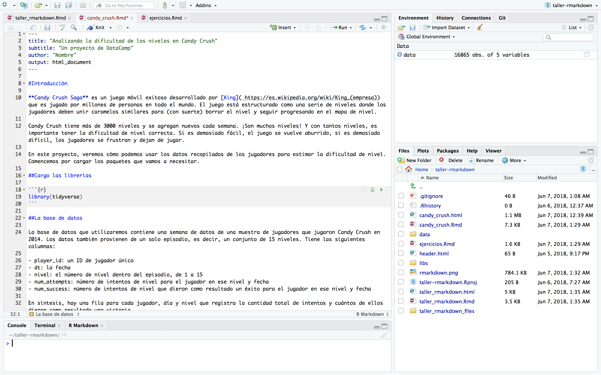

```{r setup, include=FALSE}
library(highcharter)
file.remove(dir("wdgts/", full.names = TRUE))

knitr::opts_chunk$set(fig.path = "static/img/", echo = TRUE, cache = TRUE, message = FALSE)

options(highcharter.theme =
          hc_theme_smpl(chart = list(
            backgroundColor = "transparent",
            style = list(fontFamily = "Source Sans Pro"))
            ))
source("setup.R")

```
# <br><br>Computación Estadística con R<br><small>Clase 4 <br><br> Rubén Soza</small>{ .center .white data-background="#75AADB" }

# Introducción a R Markdown{ .center .white data-background="#75AADB" }

## {data-background-video="video1.mp4"}


## ¿Qué es R Markdown?

- Marco unificado para ciencia de datos
- Combina:
    - Código
    - Resultados
    - Comentarios en prosa
- Los documentos R Markdown son totalmente reproducibles y automatizables.

## Diferentes formatos de salida

   
   
## Primer vistazo


---
#**Detrás de escenas**

1) Cuando le damos `knit` al documento, R Markdown envía el archivo `.Rmd` a knitr, este ejecuta los fragmentos de código y crea un nuevo documento de formato `.md` que incluye el código y su salida

2) Este archivo generado es luego procesado por `pandoc`, que es responsable de crear el archivo terminado. 

`Ventaja flujo de trabajo de dos pasos:` ¡se puede crear una amplia gama de formatos de salida!


---

#**Sintaxis**

- `*cursiva*` y `_cursiva_`

- `**negrita**` y `__negrita__`

- `[link](www.rstudio.com)`

- `# Encabezado 1`

- `## Encabezado 2`

- `### Encabezado 3`

- imagen: ``

- ` - lista`

---
#**Código**

    1) Código incrustado: envuelvo el código con contratildes y r, R reemplaza el código 
    en línea con sus resultados
   
    2) Fragmentos de código: comienza un trozo (chunk) con ```{r} y lo termino con ```


Opción  | Efecto
------  | -------------------
include | ¿Muestra el fragmento de código de R y su resultado?
echo    | ¿Muestra el fragmento de código de R?
message | ¿Muestra los mensajes de salida?
warning | ¿Muestra las advertencias?
eval    | ¿Evalúa el fragmento de código?
---
#**Ecuaciones LaTeX**

- se pueden escribir en modo matemático en la línea de texto comenzando y terminando con `$`, por ejemplo: `$\alpha+\beta$` muestra $\alpha+\beta$

- se pueden escribir ecuaciones comenzando y terminando con `$$`, por ejemplo:

$$\bar{X}=\frac{1}{n}\sum_{i=1}^nX_i$$

---
# **Configuración avanzada del YAML**

```{r, eval=FALSE}
---
title: "Analizando la dificultad de los niveles en Candy Crush" 
subtitle: "Un proyecto de DataCamp"
author: "Paula Pereda"
output: html_document
---
```

```{r, eval=FALSE}
---
title: "Analizando la dificultad de los niveles en Candy Crush" 
subtitle: "Un proyecto de DataCamp"
author: "Paula Pereda"
output:
   html_document:
      theme: paper
      highlight: tango
      toc: true
      code_folding: show
pdf_document:
...
---
```
---
#**Material ejercicios**

```{r, eval=FALSE}
$ git clone https://github.com/rladies/meetup-presentations_montevideo/
```
O,

Descargar zip de acá: https://bit.ly/2M0B88F

Están basados en un proyecto de [DataCamp](https://www.datacamp.com/projects/139).
---
#**Ejercicios: parte I**

Convertir los títulos de las secciones de estos párrafos en encabezados utilizando la sintaxis apropiada, usando diferentes niveles de encabezado para las secciones y subsecciones:

    1) Secciones (encabezados de primer nivel): Introducción, La base de datos, Computando 
    el nivel de dificultad, Computando la incertidumbre, Una métrica final

    2) Subsecciones (encabezados de segundo nivel): Chequeando la base de datos, Graficando 
    el perfil de dificultad, Detectando niveles difíciles, Mostrando incertidumbre

    3) Haga una lista con las columnas de la base de datos (líneas 24-28)
---
class: center, middle

#**Solución: parte I**

```{r echo=F, out.width='90%'}
knitr::include_graphics('solucion_1.png')
```

---
#**Ejercicios: parte II**

    1) En la línea 10, convertir "Candy Crush Saga" en negrita

    2) Convertir "King" (línea 10) en un link hacia: 
    https://es.wikipedia.org/wiki/King_(empresa)

    3) Enfatice el texto en la línea 141 convirtiéndola en itálica

    4) Incluir la imagen del siguiente link en la Introducción:
    http://www.garotasgeeks.com/wp-content/uploads/2014/05/candy-crush1-610x240.png
---
class: center, middle

#**Solución: parte II**

```{r echo=F, out.width='90%'}
knitr::include_graphics('solucion_2.png')
```

---
#**Ejercicios: parte III**

    1) Quitar los mensajes que genera el cargar la librería en la línea 18

    2) Cargar los datos y mostrar las primeras filas de la base de datos (línea 36) 
    sin que me muestre el código ni los mensajes

    3) Sabiendo que el código para calcular el número de jugadores y el período que 
    abarcan los datos es length(unique(data$player_id)) y range(data$dt), 
    respectivamente, completar con un código incrustado la línea 44
---
class: center, middle

#**Solución: parte III**

```{r echo=F, out.width='80%'}
knitr::include_graphics('solucion_3.png')
```

---
#**Ejercicios: parte IV**

    1) Convertir las ecuaciones de las líneas 52, 97, 101,
    105 de modo que se vean como ecuaciones de LaTeX
---
class: center, middle

#**Solución: parte IV**

```{r echo=F, out.width='90%'}
knitr::include_graphics('solucion_4.png')
```

---
#**Ejercicios: parte V**

    1) Agregar el theme "paper"

    2) Aregar índice

    3) ¿Qué pasa si agrego la opción 'code_folding: show'?
---
class: center, middle

#**Solución: parte V**

```{r echo=F, out.width='90%'}
knitr::include_graphics('solucion_5.png')
```
